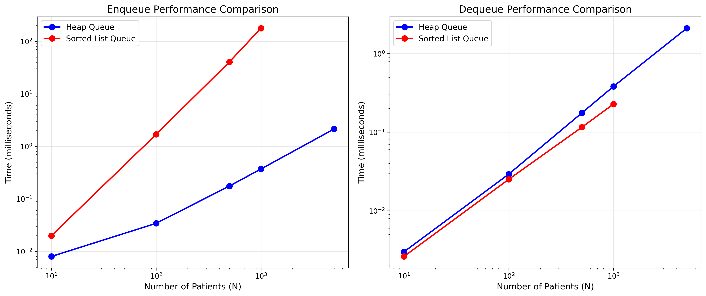

# Hospital Emergency Triage and Dispatch System - Project Report

> **Project Name**: Hospital Team 1  
> **Version**: 0.1.0  
> **Python Requirement**: >= 3.11  
> **Report Date**: 2026-07-09

---

## 1. Project Background

### 1.1 Scenario

This project models what happens during an 8-hour shift in a hospital emergency department. Patients arrive at different times and with different levels of urgency. The main problem is how to use limited medical resources, such as doctors or workstations, in a reasonable way.

If we only use normal first-in-first-out order, a serious patient may wait behind several minor cases. That is why this project uses triage levels and priority queues. Patients with higher urgency should be treated first, while the system still tries to keep waiting times within acceptable limits.

### 1.2 Main Goals

| Goal | Description |
|------|-------------|
| Core data structures | Build the `Patient` model, `TriageLevel` enum, and linked-list waiting room |
| Two priority queues | Implement a heap-based queue and an ordered linked-list queue |
| Data input | Generate patient data and load it from CSV |
| Shift simulation | Simulate an 8-hour emergency department shift |
| Performance comparison | Compare enqueue and dequeue time for both queue types |
| Queue analysis | Analyze average wait time, priority inversion, and timeout risk |
| Visualization | Show the results in a bilingual Flask dashboard |
| Prediction | Estimate which patients may exceed their waiting-time limit |

---

## 2. Data Structure Design

### 2.1 TriageLevel

Defined in `hospital_team1/models/triage.py`.

| Level | Enum Value | Meaning | Max Allowed Wait |
|-------|------------|---------|------------------|
| CRITICAL | 1 | Life-threatening | 0 min |
| URGENT | 2 | Emergent | 20 min |
| SEMI_URGENT | 3 | Semi-urgent | 35 min |
| NON_URGENT | 4 | Non-urgent | 60 min |

Lower values mean higher priority. We also use `Patient.get_max_allowed_wait()` as the only place that stores the wait-time limit, so we do not repeat the same threshold in different files.

### 2.2 Patient Model

Defined in `hospital_team1/models/patient.py` as a `dataclass`.

| Attribute | Type | Description |
|-----------|------|-------------|
| `patient_id` | `str | int` | Patient ID |
| `name` | `str` | Patient name |
| `age` | `int` | Patient age |
| `triage_level` | `TriageLevel` | Triage level |
| `arrival_time` | `datetime` | Arrival time |
| `estimated_treatment_minutes` | `int` | Estimated treatment duration |

The sorting rule in `__lt__` is simple:

- First compare `triage_level`
- If the level is the same, compare `arrival_time`

So the system follows "higher priority first, earlier arrival first within the same level."

### 2.3 WaitingRoom

Defined in `hospital_team1/structures/waiting_room.py`.

This part uses a singly linked list to store patients in the waiting area.

- Regular patients are added to the tail
- Critical patients can be inserted at the head
- Main operations include `add_patient()`, `find_patient_by_id()`, `remove_patient_by_id()`, `get_all_waiting_patients()`, `get_size()`, and `is_empty()`

### 2.4 Custom Min-Heap

Defined in `hospital_team1/structures/my_heap.py`.

We did not use Python's built-in `heapq` here. Instead, we wrote our own heap operations:

- `heappush(heap, item)`
- `heappop(heap)`
- `_sift_up()`
- `sift_down()`

This was mainly done to match the course requirement and to show that we understand how the heap works internally.

### 2.5 SortedLinkedList

Defined in `hospital_team1/structures/sorted_linked_list.py`.

This linked list keeps elements sorted during insertion. It is later used by the ordered linked-list priority queue.

---

## 3. Priority Queue Implementation

### 3.1 Abstract Base Class

Defined in `hospital_team1/queues/base.py`.

This file defines the common queue interface:

| Method | Purpose |
|--------|---------|
| `enqueue(patient)` | Add a patient |
| `dequeue()` | Remove and return the highest-priority patient |
| `peek()` | View the highest-priority patient |
| `is_empty()` | Check if the queue is empty |
| `__len__()` | Get queue size |
| `get_all_sorted_patients()` | Return patients in priority order |

### 3.2 HeapPriorityQueue

Defined in `hospital_team1/queues/heap_priority_queue.py`.

- Uses the custom min-heap
- Heap key: `(triage_level.value, arrival_time.timestamp(), patient)`
- Enqueue: `O(log n)`
- Dequeue: `O(log n)`

This implementation is more suitable when we have many insertions.

### 3.3 OrderedLinkedPriorityQueue

Defined in `hospital_team1/queues/ordered_linked_priority_queue.py`.

- Uses `SortedLinkedList`
- Keeps the queue sorted on insertion
- Enqueue: `O(n)`
- Dequeue: `O(1)`

This version is easier to understand and works well for small queue sizes, but insertion becomes slower when the queue grows.

### 3.4 Comparison

| Item | HeapPriorityQueue | OrderedLinkedPriorityQueue |
|------|-------------------|---------------------------|
| Base structure | Min-heap | Ordered linked list |
| Enqueue | `O(log n)` | `O(n)` |
| Dequeue | `O(log n)` | `O(1)` |
| Better for | Large scale, frequent insertions | Small scale, frequent removals |
| Correctness check | Same dequeue order as the list queue | Same dequeue order as the heap queue |

---

## 4. Dataset Generation and Import

### 4.1 CSV Format

Default file path: `datasets/patients_dataset.csv`

| Field | Type | Description |
|-------|------|-------------|
| `patient_id` | `int` | Patient ID |
| `name` | `str` | Patient name |
| `age` | `int` | Patient age |
| `triage_level` | `int` | Triage level from 1 to 4 |
| `arrival_time` | `datetime` | Arrival time |
| `estimated_treatment_duration` | `int` | Estimated treatment duration |

### 4.2 Current Dataset

The default dataset has 20 records. The arrival times are between `2026-06-30 08:14` and `2026-06-30 14:55`.

| Triage Level | Count | Proportion |
|--------------|-------|------------|
| CRITICAL | 2 | 10% |
| URGENT | 5 | 25% |
| SEMI_URGENT | 8 | 40% |
| NON_URGENT | 5 | 25% |

### 4.3 Data Generation Rules

Defined in `hospital_team1/data/dataset_generator.py`.

Default level distribution:

- CRITICAL: 10%
- URGENT: 25%
- SEMI_URGENT: 40%
- NON_URGENT: 25%

Generation steps:

1. Randomly choose triage levels based on the distribution
2. Generate arrival times inside the shift window
3. Generate estimated treatment duration
4. Save the data to CSV

### 4.4 CSV Loading

Defined in `hospital_team1/data/csv_loader.py`.

`load_patients_from_csv()` does the following:

1. Read the CSV file
2. Parse each row
3. Build `Patient` objects
4. Sort them by arrival time
5. Return the patient list

---

## 5. Simulation Design

### 5.1 Core Simulation

Defined in `hospital_team1/simulation/shift_simulation.py`.

The simulation is event-driven. The main events are:

- patient arrival
- workstation becomes free
- treatment starts and ends

### 5.2 Dispatch Logic

The basic flow is:

```text
Patient arrives
  -> If CRITICAL: start immediately
  -> Otherwise: enter the waiting queue

Workstation becomes free
  -> Take the highest-priority patient from the queue
  -> Start treatment

Treatment finishes
  -> Record wait time and compliance result
  -> Free the workstation
```

In the current project, critical patients are handled first and do not wait in the normal queue.

### 5.3 Compliance Check

Defined in `hospital_team1/simulation/compliance.py`.

`is_wait_time_compliant(patient, wait_minutes)` checks whether the actual wait time is within the limit returned by `Patient.get_max_allowed_wait()`.

So the rule is:

- if `wait_minutes <= max_allowed_wait`, the case is compliant
- otherwise, it is not compliant

### 5.4 Simulation Report

Defined in `hospital_team1/simulation/report.py`.

`build_shift_report()` returns:

| Metric | Meaning |
|--------|---------|
| Total treated | Number of treated patients |
| Average wait time | Mean wait time for treated patients |
| Compliance rate | Percentage of compliant cases |
| Maximum wait time | Longest wait time in the shift |
| Untreated count | Patients still waiting at shift end |

### 5.5 Simulation Engine Wrapper

Defined in `hospital_team1/simulation/engine.py`.

`SimulationEngine` is a simple wrapper that:

- loads patients from CSV
- runs the simulation
- returns the result

---

## 6. Performance Benchmarking

### 6.1 Benchmark Setup

Defined in `hospital_team1/analysis/performance_analysis.py`.

We benchmark both queue implementations by:

- generating patients at different scales
- measuring total enqueue time
- measuring total dequeue time
- saving the result to `performance_results.csv`
- plotting the result in `performance_comparison.png`

### 6.2 Benchmark Results

| N | Heap Enqueue (ms) | Heap Dequeue (ms) | List Enqueue (ms) | List Dequeue (ms) |
|---|-------------------|-------------------|-------------------|-------------------|
| 10 | 0.019 | 0.007 | 0.016 | 0.003 |
| 100 | 0.041 | 0.092 | 1.111 | 0.016 |
| 500 | 0.259 | 0.817 | 26.90 | 0.072 |
| 1,000 | 0.426 | 1.379 | 106.18 | 0.156 |
| 5,000 | 2.509 | 9.581 | 2,552.69 | 0.694 |
| 10,000 | 5.995 | 19.255 | N/A | N/A |

### 6.3 Performance Chart



### 6.4 What We Learned

1. Heap enqueue grows much more slowly than list enqueue.
2. Ordered linked list dequeue is very fast, but its insert cost becomes too high when the queue is large.
3. For this kind of hospital scenario, where patients keep arriving, heap-based insertion is more practical.
4. At large scale, the linked-list queue becomes too slow for enqueue operations.

---

## 7. Waiting Room Analysis

### 7.1 Average Wait by Triage Level

Defined in `hospital_team1/analysis/waiting_room_analytics.py`.

This part groups patients by triage level and calculates:

- average wait time
- maximum wait time
- number of violations

It helps us see which level is under the most pressure.

### 7.2 Priority Inversion Detection

A priority inversion means that a lower-priority patient is effectively doing better than a higher-priority one in the same snapshot.

The code checks:

- who is waiting
- how long each person has waited
- whether a higher-priority patient is waiting longer than a lower-priority one

If that happens, the system records it as an anomaly.

### 7.3 Estimated Wait for New Patients

The project also estimates how long a new patient may wait based on:

- the current queue
- the current workstation state
- triage level

This is useful for quick risk checking and for discussing whether more resources are needed.

---

## 8. Timeout Prediction

### 8.1 Main Idea

Defined in `hospital_team1/analysis/timeout_prediction.py`.

`TimeoutPredictor` tries to answer one question:

> If we keep using the current queue order, which patients are likely to exceed their waiting-time limit?

It uses:

- the current queue
- the projected service start time
- each patient's own threshold

### 8.2 Risk Summary

`summarize_timeout_risk()` returns:

| Metric | Meaning |
|--------|---------|
| At-risk patient count | Number of patients likely to exceed the limit |
| Risk percentage | At-risk count divided by queue size |
| High-risk list | IDs and brief patient details |

### 8.3 Current Limits

This prediction module still has some limits:

1. It assumes a fixed number of workstations
2. It does not model patients leaving before treatment
3. It uses estimated treatment time, not real measured treatment time
4. It does not fully model all possible future interruptions

### 8.4 Next Improvements

Some clear next steps are:

1. support dynamic workstation changes
2. model more realistic patient flow
3. improve prediction with historical data
4. add clearer automatic alerts in the dashboard

---

## 9. Visualization and Interaction

### 9.1 Flask Dashboard

Defined in `hospital_team1/visualization/gui.py`.

Main routes:

| Route | Description |
|-------|-------------|
| `/` | Main bilingual dashboard |
| `/api/actions/run-simulation` | Run simulation action |
| `/artifacts/<filename>` | Download generated files |
| `/healthz` | Health check |

The dashboard also supports `snapshot_offset`, so we can view the queue at different time points instead of only looking at one fixed moment.

### 9.2 Dashboard Data

Defined in `hospital_team1/visualization/dashboard_data.py`.

`get_dashboard_context()` prepares data for:

| Item | Description |
|------|-------------|
| Queue size | Number of patients waiting |
| Average wait | Current mean wait time |
| Compliance rate | Current compliance summary |
| Risk trend | Timeout risk result |
| Waiting patient list | Patients shown in queue order |
| Heap view | Queue shown as a heap structure |
| Anomaly result | Priority inversion results |
| Timeout result | At-risk patient list |
| Wait chart | Wait trend over time |
| Performance table | Heap vs list comparison |
| Project map | Module overview |

### 9.3 CLI View

Defined in `hospital_team1/visualization/cli_views.py`.

This is a simple text-based view that is useful when testing locally without opening the web UI.

---

## 10. Project Structure Overview

```text
hospital-team1/
|-- hospital_team1/
|   |-- models/
|   |   |-- patient.py
|   |   `-- triage.py
|   |-- structures/
|   |   |-- linked_list.py
|   |   |-- waiting_room.py
|   |   |-- sorted_linked_list.py
|   |   `-- my_heap.py
|   |-- queues/
|   |   |-- base.py
|   |   |-- heap_priority_queue.py
|   |   |-- ordered_linked_priority_queue.py
|   |   `-- sorted_linked_list_queue.py
|   |-- data/
|   |   |-- csv_loader.py
|   |   `-- dataset_generator.py
|   |-- simulation/
|   |   |-- shift_simulation.py
|   |   |-- compliance.py
|   |   |-- report.py
|   |   `-- engine.py
|   |-- analysis/
|   |   |-- performance_analysis.py
|   |   |-- timeout_prediction.py
|   |   |-- waiting_room_analytics.py
|   |   |-- waiting_room_insights.py
|   |   |-- predictor.py
|   |   `-- run_analysis.py
|   |-- visualization/
|   |   |-- gui.py
|   |   |-- dashboard_data.py
|   |   |-- cli_views.py
|   |   `-- heap_tree.py
|   `-- utils/
|       |-- constants.py
|       `-- time_utils.py
|-- datasets/
|   `-- patients_dataset.csv
|-- tests/
|   |-- test_smoke.py
|   |-- test_models/
|   |-- test_structures/
|   |-- test_queues/
|   |-- test_data/
|   |-- test_simulation/
|   |-- test_analysis/
|   `-- test_visualization/
|-- scripts/
|   |-- launch_gui.py
|   |-- run_simulation.py
|   |-- generate_dataset.py
|   |-- benchmark_priority_queues.py
|   `-- _bootstrap.py
|-- docs/
|   |-- index.md
|   |-- module_map.md
|   |-- development_rules.md
|   `-- report_outline.md
|-- slides/
|-- main.py
|-- serve.py
|-- wsgi.py
|-- Dockerfile
|-- Procfile
|-- pyproject.toml
|-- performance_results.csv
`-- performance_comparison.png
```

---

## 11. Test Coverage

The test suite covers the main parts of the project.

| Test Type | File | What It Checks |
|-----------|------|----------------|
| Smoke test | `test_smoke.py` | Basic import checks |
| Model tests | `test_models/test_patient.py` | Patient fields and sorting |
| Structure tests | `test_structures/test_waiting_room.py` | Waiting room operations |
| Structure tests | `test_structures/test_sorted_linked_list.py` | Sorted insertion behavior |
| Structure tests | `test_structures/test_my_heap.py` | Heap push and pop |
| Queue tests | `test_queues/test_priority_queues.py` | Queue correctness and consistency |
| Data tests | `test_data/test_csv_loader.py` | CSV parsing |
| Simulation tests | `test_simulation/test_shift_simulation.py` | Shift simulation logic |
| Compliance tests | `test_simulation/test_compliance.py` | Threshold checks |
| Report tests | `test_simulation/test_report.py` | Report values |
| Prediction tests | `test_analysis/test_timeout_prediction.py` | Timeout prediction |
| GUI tests | `test_visualization/test_gui.py` | Flask routes and responses |

Run commands:

```bash
python test.py
python -m unittest discover -s tests -p "test_*.py"
```

---

## 12. Deployment

### 12.1 Local Run

```bash
pip install .
python scripts/launch_gui.py
# open http://127.0.0.1:5055
```

### 12.2 Production-Style Options

| Method | Entry File | Description |
|--------|------------|-------------|
| Waitress | `serve.py` | Runs the app on `0.0.0.0:5055` |
| WSGI | `wsgi.py` | Exports `app` for WSGI servers |
| Docker | `Dockerfile` | Container setup |
| PaaS | `Procfile` | Example process entry for simple hosting |

Environment variables:

- `PORT`
- `HOSPITAL_TEAM1_PORT`
- `HOSPITAL_TEAM1_HOST`

---

## 13. Data Flow Summary

```text
patients_dataset.csv
  -> csv_loader.load_patients_from_csv()
  -> list[Patient]
  -> WaitingRoom / PriorityQueue
  -> shift_simulation.build_queue_snapshot()
  -> shift_simulation.run_shift_simulation()
  -> report.build_shift_report()
  -> analysis modules
  -> Flask dashboard
```

In short, the project starts with CSV data, turns it into patient objects, sends those objects through queue and simulation logic, then shows the result in analysis reports and the dashboard.

---

## 14. Key Design Choices

| Choice | What We Did | Why |
|--------|-------------|-----|
| Priority order | `(triage_level.value, arrival_time)` | Higher urgency first, then earlier arrival |
| Critical handling | CRITICAL patients do not wait in the normal queue | This matches the emergency setting |
| Single compliance source | Use `Patient.get_max_allowed_wait()` | Avoid duplicated threshold values |
| Two queue versions | Heap and ordered linked list | Easy to compare correctness and performance |
| Event-driven simulation | Use arrivals and workstation availability | More realistic than a simple loop |
| Bilingual UI | English and Chinese labels | Better for local demo and explanation |
| Custom heap | No `heapq` dependency | Shows the actual data-structure logic |

---

## 15. Current Strengths

At this point, the project already has some strong parts.

1. **The structure is clear**  
   The code is split into modules, so it is easier to read and explain.

2. **The workflow is complete**  
   We are not only showing one queue. The project goes from CSV input to simulation, analysis, and UI.

3. **Core structures were written by us**  
   The linked-list waiting room, sorted list, and heap are not just library calls.

4. **We can compare two queue strategies**  
   This makes the project better for discussion, testing, and performance analysis.

5. **The dashboard makes the project easier to present**  
   It helps turn backend logic into something visible and easier to explain in class.

6. **The project can still grow**  
   Since the modules are separated, it is possible to keep improving one part without rewriting everything.

---

## 16. Current Limitations

The project still has some obvious limits too.

1. **The simulation is still simplified**  
   Real hospitals are messier than our current model. We do not fully include interruptions, staff shortage, or patient abandonment.

2. **Workstation count is mostly fixed**  
   We are not yet adjusting staffing dynamically during busy periods.

3. **Some code is still transitional**  
   There are still a few wrapper or helper files that could be cleaned up more.

4. **The dataset is small**  
   It is enough for class demo, but not enough to represent real emergency department data.

5. **Prediction is rule-based**  
   We are using queue order and thresholds, not a trained predictive model.

6. **Deployment is still lightweight**  
   It works for demo and simple hosting, but it is not a full production system.

---

## 17. Future Work

If we continue this project, we think these are the most useful next steps.

1. Clean up duplicate or temporary modules
2. Use the custom heap more consistently across the project
3. Add more queue tests, especially edge cases
4. Make the simulation closer to real hospital conditions
5. Improve prediction with better data and stronger analysis
6. Make team contribution and maintenance more organized
7. Add database support and more stable deployment

---

## 18. Project Dependencies

| Dependency | Version | Purpose |
|------------|---------|---------|
| Flask | >= 3.0, < 4 | Web dashboard |
| waitress | >= 3.0, < 4 | Production WSGI server |
| coverage[toml] | >= 7.6 | Test coverage support |

---

*This report is based on the current Hospital Team 1 project code, tests, dashboard, and benchmark results.*
